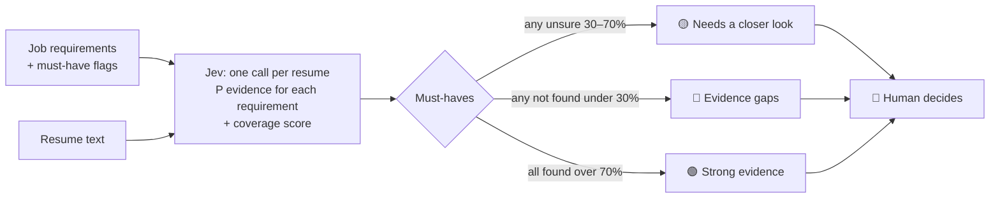

# Calibrated Screening

**AI finds the evidence. People make the call.**

Most AI resume screeners give a yes/no verdict and hide how sure they are. This one doesn't make verdicts at all.
It uses **Jev** (TypeSafe AI's decision model) to answer one narrow question per requirement:

> *Does this resume contain evidence for this requirement?* → a probability, e.g. **0.87**

Those probabilities sort candidates into three **review queues**. A human reviews every candidate.

| Queue | Meaning | What the reviewer does |
|---|---|---|
| 🟢 **Strong evidence** | Every must-have is backed by the resume | Read these first |
| 🟡 **Needs a closer look** | Jev is *unsure* about a must-have (probability 30–70%) | Check the specific line Jev couldn't judge |
| 🔴 **Evidence gaps** | No evidence found for a must-have | Confirm the gap. The resume may just be badly written |

Nobody is rejected automatically.

## Why this design

1. **Uncertainty is shown, not hidden.** A generative LLM gives a confident-sounding answer either way. Jev returns a
   probability for each requirement, so "I'm not sure" becomes its own queue instead of a silent wrong answer.
2. **Evidence, not verdicts.** Asking a model "should we hire this person?" is legally and ethically risky
   (e.g. NYC's rules on automated hiring tools). Asking "is X stated in this text?" is a narrow, checkable question.
3. **Fast and cheap.** One Jev call per resume answers every question in parallel, in about 100 ms, at $0.042 per million input tokens.

## How it works



What Jev is asked, per resume:

| Question | Jev type | Returns |
|---|---|---|
| `req_<id>`: "Does `resume` contain evidence for *\<requirement\>*?" | `noul` (yes/no) | P(yes), 0–1 |
| `coverage`: "How many requirements are evidenced?" | `score` (0–4) | score + confidence |

The rules live in one small function: `assignLane` in [`lib/screening.ts`](lib/screening.ts). The thresholds are in `POLICY`.

## Three ways to run Jev

| Mode | When | How |
|---|---|---|
| **Mock** | Building the UI, no access yet | Default. Fake answers from keyword matching. **Not real.** |
| **Live** | You have a TypeSafe key | Put `TYPESAFE_API_KEY` in `.env.local` |
| **Jev** | No key of your own, but PromptQL's bot can call Jev | The bot reads `promptql/requests.json` from this repo, runs Jev, and commits `promptql/results.json`. In the app: **Jev** → **Load results from GitHub** |

Full steps and the prompt to give the bot: [`promptql/README.md`](promptql/README.md). If the bot can't write to GitHub,
it replies with the JSON and you paste it into the app instead.

## Comparison: ATS keywords vs open-source LLM vs Jev

The page opens on **Compare all 3**: the same evidence questions answered by

| Method | How | Where it runs |
|---|---|---|
| ATS keywords | Word matching, no AI | Live in the app |
| Open-source LLM | Local Ollama model writes yes/no + a confidence number | Saved run (`promptql/llm-results.json`) |
| Jev | Typed decision model returns a probability | Saved run via PromptQL (`promptql/results.json`) |

To refresh the LLM baseline: install [Ollama](https://ollama.com), `ollama pull llama3.2:3b`, then
`npm run llm:run` and push `promptql/llm-results.json`.

## Run it

```bash
npm install
cp .env.example .env.local   # optional: add TYPESAFE_API_KEY
npm run dev                  # http://localhost:3000
```

## Code map

```
app/page.tsx             UI: requirements editor, run buttons, three review queues
app/api/screen/route.ts  Server route for live/mock runs (keeps the API key server-side)
lib/screening.ts         ★ The logic: questions sent to Jev + how answers become queues
lib/promptql.ts          Bot prompts for PromptQL; parses the bot's Jev results
promptql/                requests.json (bot reads) → results.json (bot writes)
scripts/export-requests.ts  Regenerates promptql/requests.json (npm run promptql:export)
lib/jev.ts               Jev HTTP client + mock
lib/screen-server.ts     Server-side glue: call Jev → interpret
data/sample.ts           Fictional job + 8 fictional resumes (clear, weak and ambiguous on purpose)
```

## Roadmap

- [ ] Run the 8 samples through PromptQL and tune `POLICY` thresholds on real probabilities
- [ ] Paste/upload your own resumes (PDF → text)
- [ ] Draft requirements from a job description with an LLM (Jev decides, an LLM writes)
- [ ] Show the resume line behind each "evidenced" requirement
- [ ] Eval tab: Jev vs a chat LLM on a hand-labeled set: agreement, latency, cost
- [ ] Deploy to Vercel + 2-minute demo video
